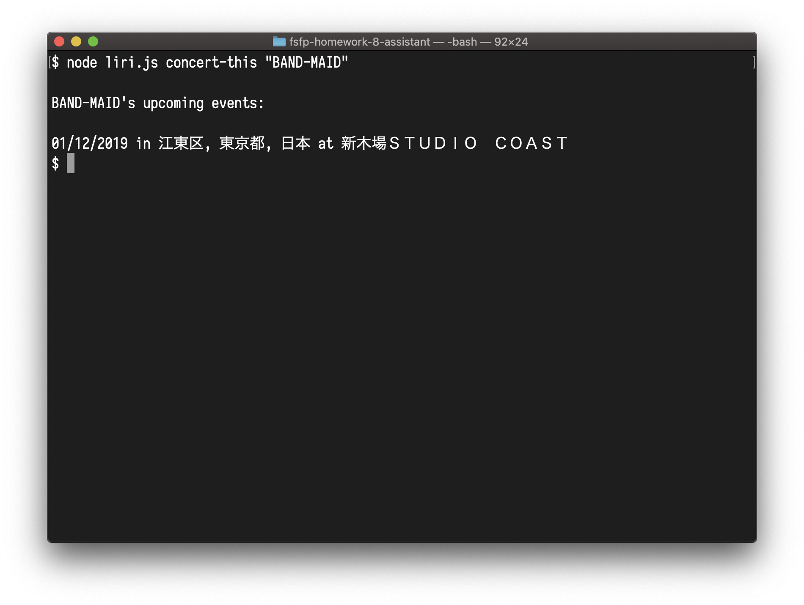
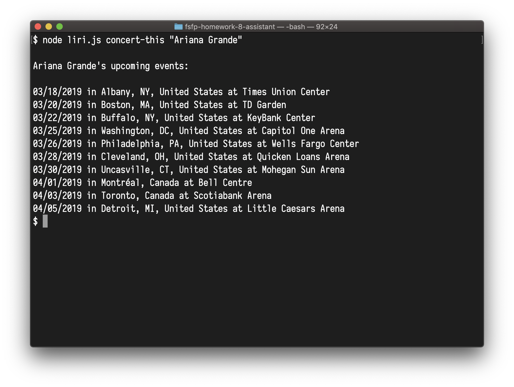
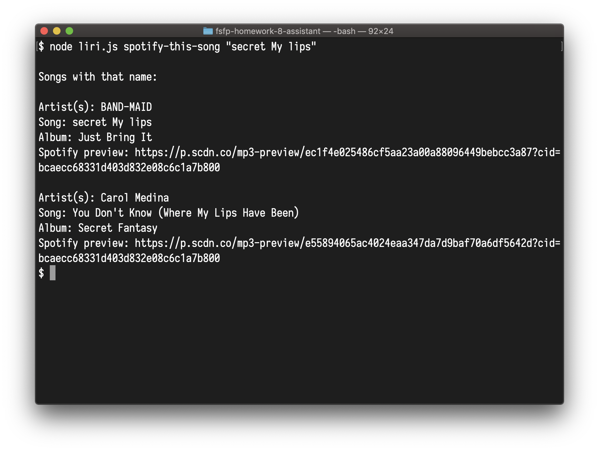
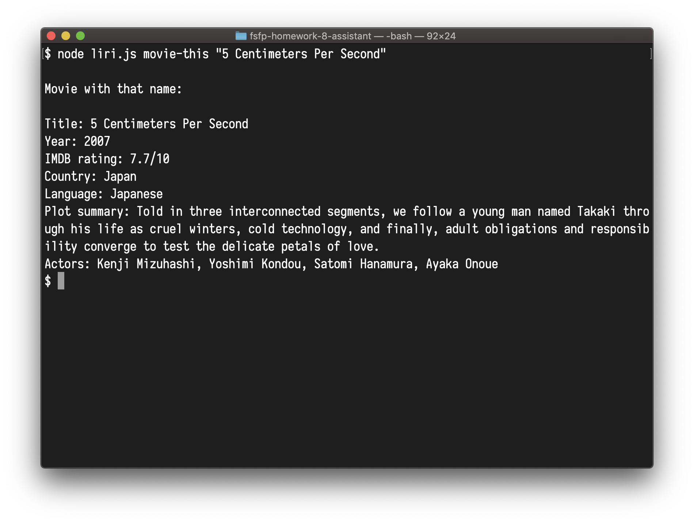

# fsfp-homework-8-assistant

Full Stack Flex Program Homework 8: Assistant


# Introduction

Meet LIRI! LIRI is a command line program that executes commands you type and looks for information on the internet.

LIRI can currently do the following:

* Look for artist upcoming concerts in Bandisintown.
* Look for song details in Spotify.
* Look for movie details in OMDB.


# Artist Upcoming Concerts

To look for an artist's upcoming concerts, run LIRI with the following command:

```
node liri.js concert-this "Artist Name"
```

Where you type your favorite artist instead of "Artist Name". Make sure to use double quotes around the artist name!

## Example: BAND-MAID

To ask LIRI for BAND-MAID's upcoming concerts, use the following command:

```
node liri.js concert-this "BAND-MAID"
```

LIRI in action:



## Example: Ariana Grande

To ask LIRI for BAND-MAID's upcoming concerts, use the following command:

```
node liri.js concert-this "Ariana Grande"
```

LIRI in action:




# Song Details

To look for song details, run LIRI with the following command:

```
node liri.js spotify-this-song "Song Name"
```

Where you type your favorite song name instead of "Song Name". Make sure to use double quotes around the song name!

## Example: secret My lips

To ask LIRI for the song "secret My lips", use the following command:

```
node liri.js concert-this "secret My lips"
```

LIRI in action:




# Movie Details

To look for movie details, run LIRI with the following command:

```
node liri.js movie-this "Movie Name"
```

Where you type your favorite movie name instead of "Movie Name". Make sure to use double quotes around the movie name!

## Example: 5 Centimeters per Second

To ask LIRI for the movie "5 Centimeters Per Second", use the following command:

```
node liri.js movie-this "5 Centimeters Per Second"
```

LIRI in action:




# Use Command in File 'random.txt'

You can provide commands to LIRI in a text file named 'random.txt'.

To tell LIRI to use the file, run LIRI with the following command:

```
node liri.js do-what-it-says
```

The file should have a comma between the command and the artist/song/movie name like so:

```
command,"Artist/Song/Movie Name"
```

## Example: "I Want it That Way"

To ask LIRI for the song "I Want it That Way", have the following in file 'random.txt':

```
spotify-this-song,"I Want it That Way"
```

Then run LIRI using

```
node liri.js do-what-it-says
```

LIRI in action:

~[node liri.js do-what-it-says](readme/do-what-it-says.png)


# History

## Build 2

* Add message if LIRI does not find concerts.
* Documentation.

## Build 1

* Completed basic features.
